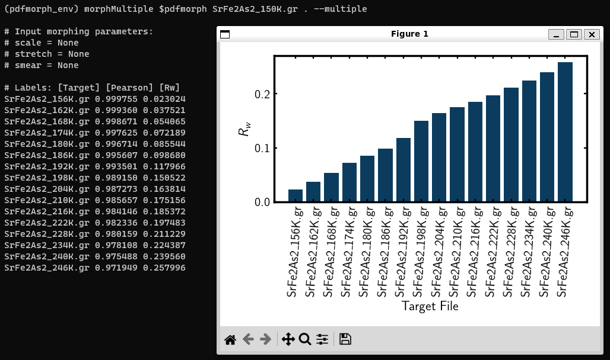
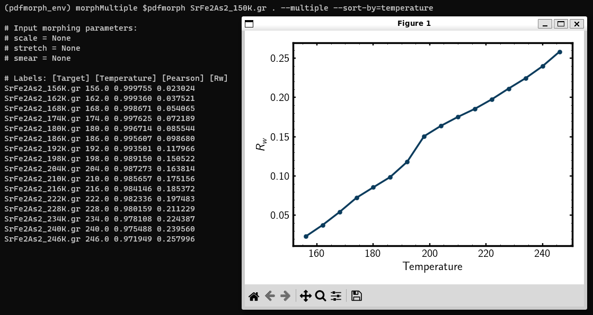

.. _quick_start:

diffpy.morph Tutorial
#####################

Welcome! This will be a quick tutorial to accquaint users with ``diffpy.morph``
and some of what it can do. To see more details and definitions about
the morphs please see the publication describing ``diffpy.morph``.

To be published:

*

As we described in the README and installation instructions, please make
sure that you are familiar with working with your command line terminal
before using this application.

Before you've started this tutorial, please ensure that you've installed
all necessary software and dependencies.

In this tutorial, we will demonstrate how to use PDFmorph to compare
two
PDFs measured from the same material at different temperatures.
The morphs showcased include "stretch", "scale", and "smear".

Basic diffpy.morph Workflow
===========================

    1. Open your Terminal or Command Prompt.

    2. If it's not active already, activate your diffpy.morph-equipped
       conda environment by typing in ::

           conda activate <diffpy_morph_env>

       * If you need to list your available conda environments,
         run the command ``conda info --envs`` or
         ``conda env list``

       * Run the ``diffpy.morph --help`` command and read over the
         info on that page for a brief overview of some of what we will
         explore in this tutorial.

    3. Using the ``mkdir`` command, create a directory where you'll
       store the tutorial PDF files and use the ``cd`` command to change
       into that directory. You can download the tutorial files
       :download:`here <../../tutorial/tutorialData.zip>`.
       Then, ``cd`` into the ``tutorialData`` directory.

       * The files in this dataset were collected by Soham Banerjee
         at Brookhaven National Laboratory in Upton, New York.

       * The files are PDF data collected on Iridium Telluride with
         20% Rhodium Doping (IrRhTe2) with the first file (01) collected
         at 10K and the last (44) at 300K. The samples increase in
         temperature as their numbers increase. The "C" in their names
         indicates that they have undergone cooling.

       * Note that these files have the ``.gr`` extension, which
         indicates that they are measured PDFs. The ``.cgr`` file
         extension indicates that a file is a calculated PDF, such as
         those generated by the
	 `PDFgui <https://www.diffpy.org/products/pdfgui.html>`_
         program.

    4. First, we will run the ``diffpy.morph`` application without any morphing
       and only using one PDF. Type the following command into your
       command line ::

           diffpy.morph darkSub_rh20_C_01.gr darkSub_rh20_C_01.gr

       This should produce two PDF curves which are congruent, resulting
       in a flat green line underneath them.

    5. Now, we will see ``diffpy.morph`` run with two different PDFs and no
       morphing. Type the following command into your command line ::

           diffpy.morph darkSub_rh20_C_01.gr darkSub_rh20_C_44.gr

       Without morphing, the difference Rw = 0.407. This indicates that
       the two PDFs vary drastically.

       * While running the ``diffpy.morph`` command, it is important
         to remember that the first PDF file argument you provide
         (in this case, ``darkSub_rh20_C_01.gr``) is the PDF which
         will get morphed, while the second PDF file argument you
         provide (here, ``darkSub_rh20_C_44.gr``) is the PDF which
         acts as the model and does not get morphed. Hereinafter,
         we will refer to the first PDF argument as the "morph"
         and the second as the "target", as the ``diffpy.morph`` display
         does.

    .. figure:: images/qs_tutorial_unmorphed.png
       :align: center
       :figwidth: 100%

       Using ``pdfmorph`` to compare two different PDFs without morphing.

    6. Now, we will start the morphing process, which requires us to
       provide initial guesses for our scaling factor, Gaussian smear,
       and stretch, separately. We will start with the scaling factor.
       Begin by typing the command ::

           diffpy.morph --scale=2 -a darkSub_rh20_C_01.gr darkSub_rh20_C_44.gr

       Now, the difference Rw = 1.457, a significant increase from our
       value previously. We must modify our initial value for the
       scaling factor and do so until we see a reduction in the
       difference Rw from the unmorphed value. Type ::

           diffpy.morph --scale=0.9 -a darkSub_rh20_C_01.gr darkSub_rh20_C_44.gr

       The difference Rw is now 0.351, lower than our unmorphed
       example's value. To see ``diffpy.morph`` optimize the scale factor,
       simply drop ``-a`` from the command and type ::

           diffpy.morph --scale=0.9 darkSub_rh20_C_01.gr darkSub_rh20_C_44.gr

       ``diffpy.morph``, given a reasonable initial guess, will use find the
       optimal value for each morphing feature. Here, we see that
       ``diffpy.morph`` displays ``scale = 0.799025`` in the command prompt,
       meaning that it has found this to be the most optimal value for
       the scale factor. The difference Rw = 0.330, indicating a
       better fit than our reasonable initial guess.

       * It is the choice of the user whether or not to run values
         before removing ``-a`` when analyzing data with ``diffpy.morph``.
         By including it, you allow the possibility to move towards
         convergence before allowing the program to optimize by
         removing it; when including it, you may reach a highly
         optimized value on the first guess or diverge greatly.
         In this tutorial, we will use it every time to check
         for convergence.

    .. figure:: images/qs_tutorial_scaled.png
       :align: center
       :figwidth: 100%

       ``PDFmorph`` found an optimal value for the scale factor.

    7. Now, we will examine the Gaussian smearing factor. We provide an
       initial guess by typing ::

           diffpy.morph --scale=0.8 --smear=0.5 -a darkSub_rh20_C_01.gr darkSub_rh20_C_44.gr

       And viewing the results. We've tailored our scale factor to be
       close to the value given by ``diffpy.morph``, but see that the difference
       Rw has increased substantially due to our smear value. One
       approach, as described above, is to remove the ``-a`` from the
       above command and run it again.

       * Note: The warnings that the Terminal/Command Prompt
         displays are largely numerical in nature and do not
         indicate a physically irrelevant guess. These are somewhat
         superficial and in most cases can be ignored.

       We see that this has had hardly any effect on our PDF. To see
       an effect, we restrict the ``rmin`` and ``rmax`` values to
       reflect relevant data range by typing ::

           diffpy.morph --scale=0.8 --smear=0.5 --rmin=1.5 --rmax=30 darkSub_rh20_C_01.gr darkSub_rh20_C_44.gr

       Now, we see that the difference Rw = 0.204 and that the optimized
       ``smear=-0.084138``.

       * We restricted the r values because some of the Gaussian
         smear effects are only visible in a fixed r range. We
         chose this r range by noting where most of our relevant
         data was that was not exponentially decayed by
         instrumental shortcomings.

    We are getting closer to an acceptably close fit to our data!

    8. Finally, we will examine the stretch factor. Provide an initial
       guess by typing ::

           diffpy.morph --scale=0.8 --smear=-0.08 --stretch=0.5 --rmin=1.5 --rmax=30 -a darkSub_rh20_C_01.gr darkSub_rh20_C_44.gr

       And noting that the difference has increased. Before continuing,
       see if you can see which direction (higher or lower) our initial
       estimate for the stretch factor needs to go and then removing
       the ``-a`` to check optimized value!

       If you cannot, type ::

           diffpy.morph --scale=0.8 --smear=-0.08 --stretch=0.005 --rmin=1.5 --rmax=30 -a darkSub_rh20_C_01.gr darkSub_rh20_C_44.gr

       to observe decreased difference and then remove ``-a`` to see
       the optimized ``--stretch=0.001762``. We have now reached
       the optimal fit for our PDF!

    .. figure:: images/qs_tutorial_morphed.png
       :align: center
       :figwidth: 100%

       The optimal fit after applying the scale, smear, and stretch morphs.

    9. Now, try it on your own! If you have personally collected or
       otherwise readily available PDF data, try this process to see if
       you can morph your PDFs to one another. Many of the parameters
       provided in this tutorial are unique to it, so be cautious about
       your choices and made sure that they remain physically relevant.

Enjoy the software!

.. Additional diffpy.morph Functionality/Exploration
.. -------------------------------------------------
.. TODO include undoped PDF example

Extra Tutorials
===============
``diffpy.morph`` has some more functionalities not showcased in the basic workflow above
(see `diffpy.morph --help` for an overview of these functionalities).
Tutorials for these additional functionalities are included below. Additional
files for these tutorials can be downloaded
:download:`here <../../tutorial/additionalData.zip>`.

Performing Multiple Morphs
--------------------------

It may be useful to morph a PDF against multiple targets:
for example, you may want to morph a PDF against multiple PDFs measured
at various temperatures to determine whether a phase change has occurred.
``diffpy.morph`` currently allows users to morph a PDF against all files in a
selected directory and plot resulting :math:`R_w` values from each morph.

1. Within the ``additionalData`` directory, ``cd`` into the
   ``morphsequence`` directory. Inside, you will find multiple PDFs of
   :math:`SrFe_2As_2` measured at various temperatures. These PDFs are
   from `"Atomic Pair Distribution Function Analysis: A primer"
   <https://global.oup.com/academic/product/
   atomic-pair-distribution-function-analysis-9780198885801>`_.

2. Let us start by getting the Rw of ``SrFe2As2_150K.gr`` compared to
   all other files in the directory. Run ::

       diffpy.morph SrFe2As2_150K.gr . --multiple-targets

   The multiple tag indicates we are comparing PDF file (first input)
   against all PDFs in a directory (second input). Our choice of file
   was ``SeFe2As2_150K.gr`` and directory was the cwd, which should be
   ``morphsequence``.

   Bar chart of :math:`R_W` values for each target file. Target files are
   listed in ASCII sort order.

3. After running this, we get chart of Rw values for each target file.
   However, this chart can be a bit confusing to interpret. To get a
   more understandable plot, run ::

       diffpy.morph SrFe2As2_150K.gr . --multiple-targets --sort-by=temperature

   This plots the Rw against the temperature parameter value provided
   at the top of each file. Parameters are entries of the form
   ``<parameter_name> = <parameter_value>`` and are located above
   the ``r`` versus ``gr`` table in each PDF file.::

     # SrFe2As2_150K.gr
     [PDF Parameters]
     temperature = 150
     wavelength = 0.1
     ...

   The :math:`R_W` plotted against the temperature the target PDF was
   measured at.

4. Between 192K and 198K, the Rw has a sharp increase, indicating that
   we may have a phase change. To confirm, let us now apply morphs
   onto `` SrFe2As2_150K.gr`` with all other files in
   ``morphsequence`` as targets ::

       diffpy.morph --scale=1 --stretch=0 SrFe2As2_150K.gr . --multiple-targets --sort-by=temperature

   Note that we are not applying a smear since it takes a long time to
   apply and does not significantly change the Rw values in this example.

5. We should now see a sharper increase in Rw between 192K and 198K.

6. Go back to the terminal to see optimized morphing parameters from each morph.

7. On the morph with ``SrFe2As2_192K.gr`` as target, ``scale =
   0.972085`` and ``stretch = 0.000508`` and with ``SrFe2As2_198K.gr``
   as target, ``scale = 0.970276`` and ``stretch = 0.000510``. These
   are very similar, meaning that thermal lattice expansion (accounted
   for by ``stretch``) is not occurring. This, coupled with the fact
   that the Rw significantly increases suggests a phase change in this
   temperature regime. (In fact, :math:`SrFe_2As_2` does transition
   from orthorhombic at lower temperature to tetragonal at higher
   temperature!). More sophisticated analysis can be done with
   `PDFgui <https://www.diffpy.org/products/pdfgui.html>`_.

8. Finally, let us save all the morphed PDFs into a directory
   named ``saved-morphs``. ::

     pdfmorph SrFe2As2_150K.gr . --scale=1 --stretch=0 --multiple-targets \
     --sort-by=temperature --plot-parameter=stretch \
     --save=saved-morphs

   Entering the directory with ``cd`` and viewing its contents with
   ``ls``, we see a file named ``morph-reference-table.txt`` with data
   about the input morph parameters and re- fined output parameters
   and a directory named ``morphs`` containing all the morphed
   PDFs. See the ``--save-names-file`` option to see how you can set
   the names for these saved morphs!

Nanoparticle Shape Effects
--------------------------

A nanoparticle's finite size and shape can affect the shape of its PDF.
We can use ``diffpy.morph`` to morph a bulk material PDF to simulate these shape effects.
Currently, the supported nanoparticle shapes include: spheres and spheroids.

* Within the ``additionalData`` directory, ``cd`` into the
  ``morphShape`` subdirectory. Inside, you will find a sample Ni bulk
  material PDF ``Ni_bulk.gr``. This PDF is from `"Atomic Pair
  Distribution Function Analysis:
  A primer" <https://global.oup.com/academic/product/
   atomic-pair-distribution-function-analysis-9780198885801>`_.
  There are also multiple ``.cgr`` files with calculated Ni nanoparticle PDFs.

* Let us apply various shape effect morphs on the bulk material to
  reproduce these calculated PDFs.

    * Spherical Shape
        1. The ``Ni_nano_sphere.cgr`` file contains a generated
	   spherical nanoparticle with unknown radius. First, let us
	   plot ``Ni_blk.gr`` against ``Ni_nano_sphere.cgr`` ::

               diffpy.morph Ni_bulk.gr Ni_nano_sphere.cgr

           Despite the two being the same material, the Rw is quite large.
           To reduce the Rw, we will apply spherical shape effects onto the PDF.
           However, in order to do so, we first need the radius of the
	   spherical nanoparticle.

        2. To get the radius, we can first observe a plot of
	   ``Ni_nano_sphere.cgr`` ::

               diffpy.morph Ni_nano_sphere.cgr Ni_nano_sphere.cgr

        3. Nanoparticles tend to have broader peaks at r-values larger
	   than the particle size, corresponding to the much weaker
	   correlations between molecules. On our plot, beyond r=22.5,
	   peaks are too broad to be visible, indicating our particle
	   size to be about 22.4. The approximate radius of a sphere
	   would be half of that, or 11.2.

        4. Now, we are ready to perform a morph applying spherical
	   effects. To do so, we use the ``--radius`` parameter ::

               diffpy.morph Ni_bulk.gr Ni_nano_sphere.cgr --radius=11.2 -a

        5. We can see that the Rw value has significantly decreased
	   from before. Run without the ``-a`` tag to refine ::

               diffpy.morph Ni_bulk.gr Ni_nano_sphere.cgr --radius=11.2

        6. After refining, we see the actual radius of the
	   nanoparticle was closer to 12.

    * Spheroidal Shape

        1. The ``Ni_nano_spheroid.cgr`` file contains a calculated
	   spheroidal Ni nanoparticle. Again, we can begin by plotting
	   the bulk material against our nanoparticle ::

               diffpy.morph Ni_bulk.gr Ni_nano_spheroid.cgr

        2. Inside the ``Ni_nano_spheroid.cgr`` file, we are given that
	   the equatorial radius is 12 and polar radius is 6. This is
	   enough information to define our spheroid. To apply
	   spheroid shape effects onto our bulk, run ::

               diffpy.morph Ni_bulk.gr Ni_nano_spheroid.cgr --radius=12 --pradius=6 -a

           Note that the equatorial radius corresponds to the
	   ``--radius`` parameter and polar radius to ``--pradius``.

        3. Remove the ``-a`` tag to refine.

There is also support for morphing from a nanoparticle to a bulk. When
applying the inverse morphs, it is recommended to set ``--rmax=psize``
where ``psize`` is the longest diameter of the nanoparticle.

Bug Reports
===========

Please enjoy using our software! If you come across any bugs in the
application, please report them to diffpy-users@googlegroups.com.
